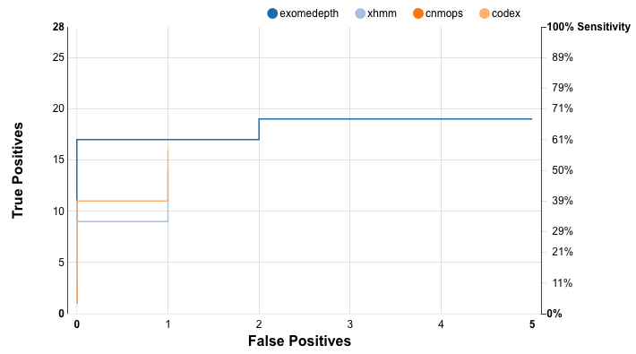

# Tutorial - Example Ximmer Analysis

This tutorial shows setting up Ximmer on a bare Ubuntu install in Google Cloud, 
and then downloading running some example data through it.

We will start with a plain vanilla Ubuntu image and install all the needed
dependencies as well as Ximmer itself, including 4 CNV callers. Then we will
download the example data and run the analysis and look at the results.

_Note_: in this walkthrough we do not run Conifer because it depends on some
outdated libraries that make it a bit more tricky to install.

## Start an Ubuntu Image

I chose an Ubuntu 16.04 LTS image with 13GB of RAM and 20GB of disk space. This
is easily done through the web console, but if you have the command line tools installed
you can create the same image using:

```
gcloud compute instances create instance-2 \
        --zone=us-east1-c \
        --machine-type=n1-highmem-2 \
        --subnet=default \
        --maintenance-policy=MIGRATE \
        --scopes=https://www.googleapis.com/auth/devstorage.read_only,https://www.googleapis.com/auth/logging.write,https://www.googleapis.com/auth/monitoring.write,https://www.googleapis.com/auth/servicecontrol,https://www.googleapis.com/auth/service.management.readonly,https://www.googleapis.com/auth/trace.append \
        --min-cpu-platform=Automatic \
        --image=ubuntu-1604-xenial-v20180509 \
        --image-project=ubuntu-os-cloud \
        --boot-disk-size=20GB \
        --boot-disk-type=pd-standard \
        --boot-disk-device-name=instance-2
```

Note: this image cost me $0.08c per hour to run. The rest of this example should work
on any plain Ubuntu 16.04 image, so you can use a different cloud provider, docker or
other Ubuntu 16.04 system that you have available (other Linux versions should also work
with only minor modifications to the steps).

## Install Dependencies

Once the image is started, install the essential dependencies:

```
gcloud compute ssh --zone "us-east1-c" "ximmer-demo"
sudo su -
echo 'deb http://cran.rstudio.com/bin/linux/ubuntu xenial/' >> /etc/apt/sources.list
apt-key adv --keyserver keyserver.ubuntu.com --recv-keys E084DAB9
apt update
apt-get install python-pip r-base openjdk-8-jdk libxml2-dev libcurl4-openssl-dev libblas-dev liblapack-dev libhdf5-dev libssl-dev libmariadb-client-lgpl-dev
exit
```

This should get all the operating system level dependencies installled.

## Setup VirtualEnv

This is somewhat optional in a cloud instance, but good hygiene in case you want to 
undo or reinstall anything to do with the python environment later:

```
pip install virtualenv
virtualenv ximmer-python
source ximmer-python/bin/activate
```

## Download Reference

```
mkdir reference
cd reference
wget ftp://gsapubftp-anonymous@ftp.broadinstitute.org/bundle/hg19/ucsc.hg19.fasta.gz
wget ftp://gsapubftp-anonymous@ftp.broadinstitute.org/bundle/hg19/ucsc.hg19.fasta.fai.gz
wget ftp://gsapubftp-anonymous@ftp.broadinstitute.org/bundle/hg19/ucsc.hg19.dict.gz
gunzip *.gz
```

Note: the choice of reference is arbitrary as long as you provide the appropriate fasta, 
.fai and .dict files.

## Install a library in R to Initialize the Personal R Directory

This step is a quirk of the fact we are installing the first ever R 
libraries on the system: the first library installed will prompt the 
creation and initialisation of the personal R library folder. Without doing 
this step manually, the later Ximmer install will fail unless you run it as root.

```
ssadedin@ximmer-demo:~/ximmer$ R

R version 3.4.4 (2018-03-15) -- "Someone to Lean On"
Copyright (C) 2018 The R Foundation for Statistical Computing
Platform: x86_64-pc-linux-gnu (64-bit)

R is free software and comes with ABSOLUTELY NO WARRANTY.
You are welcome to redistribute it under certain conditions.
Type 'license()' or 'licence()' for distribution details.

  Natural language support but running in an English locale

R is a collaborative project with many contributors.
Type 'contributors()' for more information and
'citation()' on how to cite R or R packages in publications.

Type 'demo()' for some demos, 'help()' for on-line help, or
'help.start()' for an HTML browser interface to help.
Type 'q()' to quit R.

> install.packages('XML')
```

## Clone Ximmer and Run Installer

```
cd ~
git clone https://github.com/ssadedin/ximmer.git
cd ximmer
./bin/ximmer install
  | |/ /(_)___ ___  ____ ___  ___  _____
  |   // / __ `__ \/ __ `__ \/ _ \/ ___/
 /   |/ / / / / / / / / / / /  __/ /    
/_/|_/_/_/ /_/ /_/_/ /_/ /_/\___/_/     
Please enter the location of the reference FASTA file you would like to use Ximmer with: 
/home/ssadedin/reference/ucsc.hg19.fasta
...
```

The installer runs for a while and installs all the CNV calling tools and supporting libraries.

## Download the Example Data

The example data set includes the X chromosome regions over 14 female exomes. 

```
cd ~
mkdir data
cd data
wget https://storage.googleapis.com/ximmer-example-data/ximmer-example-data.zip
unzip *.zip
```

## Create an Example Ximmer Configuration

Edit a file in the Ximmer directory called `example.groovy` and add the 
following contents which are our basic Ximmer configuration:

```
target_regions="/home/ssadedin/data/example-data/target_regions.bed"
bam_files="/home/ssadedin/data/example-data/*.bam"
regions=1..10

simulation_type='downsample'
deletionsPerSample=2

callers { 
    xhmm {}; exomedepth {}; cnmops {}; codex {}
}
```

**Note**: you'll need to replace the paths above with correct paths
based on the directory you are using.


## Run Ximmer

```
./bin/ximmer -c example.groovy  -v -o example
```

This will run for approximately 3 hours and create a new set of BAM files 
under `example/run1/bams`. These will have been analysed, with results under
`example/run1/analysis`, and an overall summary will have been written to
`example/analysis.html`.


## Viewing the results

To view the results we can look at the `example/analysis.html` file. This can be 
done simply by creating an archive and copying it down to your local computer.
Note that you have to include the related css and javascript files in the same directory.
Also note that the same directory includes the generated BAM files containing deletions,
so you can exclude these if you like.

```
tar -czf example.tar.gz --exclude '*.bam' example
```

From my laptop I could copy this down and open it using these commands:

```
gcloud compute scp --zone us-east1-c ssadedin@ximmer-demo:/home/ssadedin/ximmer/example.tar.gz . 
tar -xzf example.tar.gz 
open example/analysis.html # on mac
```

The example results from this session can be found at:

https://storage.googleapis.com/ximmer-example-data/example_results.zip

Here is a screenshot of how the ROC curve looks:




