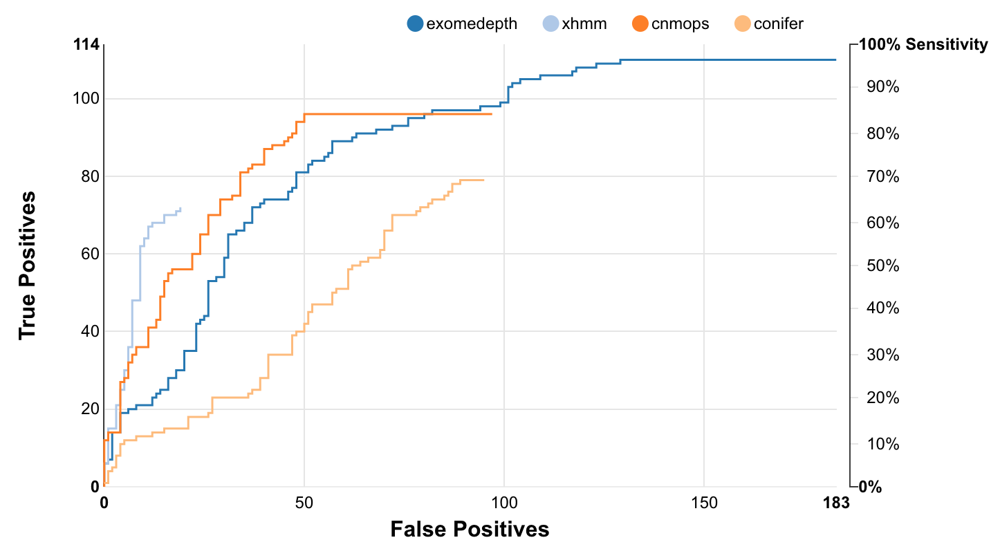

# Ximmer User Guide

## Introduction

Ximmer is a tool designed to help users of targeted high throughput (or "next generation") 
genomic sequencing data (such as exome data) to accurately detect copy number variants
(CNVs). Ximmer is not a copy number detection tool itself. Rather, it is a framework for
running and evaluating other copy number detection tools. It offers three essential features
that users of CNV detection tools need:

 * A suite of pipelines for running a variety of well known CNV detection tools
 * A simulation tool that can create artificial CNVs in sequencing data for 
   the purpose of evaluating performance
 * A visualisation and curation tool that can combine results from multiple 
   CNV detection tools and allow the user to inspect them, along with 
   relevant annotations.

We created Ximmer because although there are very many CNV detection tools,
they can be hard to run and their performance can be highly variable and
hard to estimate. This is why Ximmer builds in simulation: to allow 
a quick and easy estimation of the performance of any tool on any data set.

Want see how Ximmer results look without running it? Try out the live 
[example report](http://example.ximmer.org/).

A picture of Ximmer's accuracy report is below:




## Installation and Requirements (Native)

To make Ximmer easier to use we have included support to automatically 
download and build a range of tools. You should make sure before starting
that you have at minimum the following requirements:


 * Java 1.7 (note: Java 1.8 does not work, unless you upgrade the bundled GATK)
 * Python 2.7, preferably the Anaconda installation
 * R 3.2 or higher
   
Ideally, these should all be directly accessible from your environment. 
If necessary, you can specify custom locations for them in the configuration file.


You should also make sure you have internet access while doing the installation
because Ximmer will try to download some components. It may be necessary to set 
the "http_proxy" environment variable if your network uses a proxy.


### Run Installer

Ximmer includes a simple installer script to help set up and configure
it for basic operation. To get started:

```
git clone git@github.com:ssadedin/ximmer.git
cd ximmer
./bin/install
```

## One Time Configuration

Ximmer needs some global configuration to set some basic settings that are used
by all Ximmer anlayses. The installer sets all the basic configuration parameters to 
sensible defaults all by itself. You may like to inspect these and check if they are 
optimal for your environment.  To do this, open the file `eval/pipeline/config.groovy` in a text
editor. 

If you just want to run everything on a single computer or server then the settings 
in this file should be sufficient. If you would like to configure Ximmer to run jobs
on a cluster computing system, you can configure that by editing 
`eval/pipeline/bpipe.groovy`.

See the [Configuration](config.md) documentation for more details. 

## Docker

Ximmer comes with a Docker file that can be used to build a complete image,
fully configured including all the relevant tools.

To build the Docker image use:

```bash
git clone git@github.com:ssadedin/ximmer.git
cd ximmer/docker
docker build -t ximmer . 
```

Note: if your machine is behind a proxy, you may need to use something like this:

```bash
git clone git@github.com:ssadedin/ximmer.git
cd ximmer/docker
docker build --build-arg http_proxy='http://wwwproxy.unimelb.edu.au:8000' -t ximmer . 
```

See [Running inside Docker](docker.md) for tips on how to run inside Docker.

## Running Ximmer

See information about how to run an analysis using Ximmer in the [Running](running.md) 
section, and how to configure CNV simulation in [Simulations](simulations.md).
